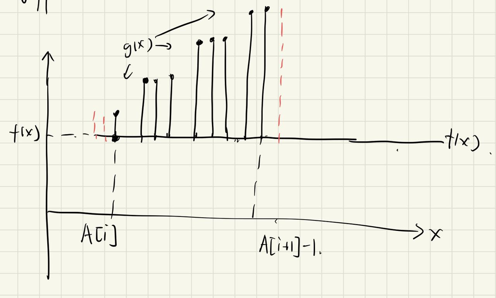

# 1. 序列查询

## 1.1 题目
http://118.190.20.162/view.page?gpid=T138

## 1.2 解题思路
$\qquad$ 对于题目要求的求和操作，不妨去考虑输入的数组A对于答案的贡献。

$\qquad$ 当某一次查询操作正好查询到$A_i$之后，在找到比$A_i$更大的数$A_{i+1}$之前，所有的查询结果都是i。一共有$(A_{i+1}-A_i) $个i。所以对于序列A中的相邻两项，他们对答案的贡献就是$(A_{i+1}-A_i)\times i$ 因此，我们只需要读入A的时候计算这样的贡献即可。

$\qquad$ 需要注意的是题目中的查询范围截至到N，对于超出$A_n$但还不到N的部分，他们的查询结果，$(N-A_n)*n$ 也需要加到答案中去.
时空复杂度都是$O(n)$

$\qquad$ 当然，由于遍历A数组时每一次操作只需要两个数据，可以用滚动数组将空间复杂度优化为$O(1)$
## 1.3 代码
```cpp
#include<iostream>
using namespace std;
using ull = unsigned long long;

void slove() {
    int n, N;
    ull res = 0;
    cin >> n >> N;
    vector<int> v(2, 0);
    for (int i = 1; i <= n; i++) {
        cin >> v[i & 1];
        res += abs(v[0] - v[1]) * (i - 1);
    }
    res += (N - max(v[0],v[1])) * n;
    cout << res << '\n';
}

int main() {
    ios::sync_with_stdio(0);
    cin.tie(0);
    slove();
}
```

  
# 2. 序列查询新解
## 2.1 题目
http://118.190.20.162/view.page?gpid=T137

## 2.2 解题思路

$\qquad$ 和上一题类似，对于数组A两项直接的所有取值，f(x)都相等，因此我们只需要遍历A数组时，将每一个间隔区间的|g(x) - f(x)| 算出来求和可以简化时间。

$\qquad$ 统一计算|g(x) - f(x)| 的时候，注意区间的两边的正负号情况。如果首尾的 g(x) - f(x) 正负号相同，直接计算即可。如果不同，则分别将负值和正值计算结果加起来即可。正负分界点与该区间最开始的值有关。

$\qquad$ 在统一计算时，可以利用等差求和公式，先将区间里根据 |g(x) - f(x)| 数值的不同分组，一般情况下的小组成员数量就是r，但分组后再可能处于边界的小组成员数量不足r。我们先将其补到r，套等差公式求和后再减去补上的成员。

示意图（以r=3为例）


$\qquad$ 可以用滚动数组优化代码，这样的话时间复杂度为$O(n)$,空间复杂度为$O(1)$

## 2.3 代码

$\qquad$ 没有用滚动数组优化的版本.使用lambda表达式主要是为了代码的可读性服务，虽然可能带来额外的性能开销，但可以基本忽略
```cpp
#include<iostream>
#define ll long long
using namespace std;

void slove() {
   **** int n, N;
    ll error = 0;
    cin >> n >> N;
    vector<int> A(n + 2, 0);
    A[n+1] = N;
    for (int i = 1; i <= n; i++)cin >> A[i];
    int r = N / (n + 1);
    for (int i = 1; i <= n+1; i++) {
        ll f = A[i - 1] / r - i + 1, l = (A[i] - 1) / r - i + 1;
        auto p = [&]()->int {
            ll res = 0;
            if (f * l >= 0) res += ((abs(f - l) + 1) * abs(f + l)) / 2 * r;
            else res += (abs(f) + 1) * abs(f) / 2 * r + (l + 1) * l / 2 * r;
            return res - abs(f) * (A[i - 1] % r) - abs(l) * ((r - (A[i] - 1) % r) - 1);
        };
        error += p();
    }
    cout << error << '\n';
    
}

int main() {
    ios::sync_with_stdio(0);
    cin.tie(0);
    slove();
}
```

使用滚动数组优化并去除了lambda的版本
```cpp
#include<iostream>
#include<vector>
#define ll long long
using namespace std;

void slove() {
    int n, N;
    ll error = 0;
    cin >> n >> N;
    int r = N / (n + 1), pre = 0;
    for (int i = 1; i <= n + 1; i++) {
        int temp = N;
        if (i != n + 1)cin >> temp;
        ll f = pre / r - i + 1, l = (temp - 1) / r - i + 1;
        ll res = 0;
        if (f * l >= 0) error += ((abs(f - l) + 1) * abs(f + l)) / 2 * r;
        else error += (abs(f) + 1) * abs(f) / 2 * r + (l + 1) * l / 2 * r;
        error-=  abs(f) * (pre % r) + abs(l) * ((r - (temp - 1) % r) - 1);
        pre = temp;
    }
    cout << error << '\n';
    
}

int main() {
    ios::sync_with_stdio(0);
    cin.tie(0);
    slove();
}
```

# 3. 登机牌条码
## 3.1 题目
http://118.190.20.162/view.page?gpid=T136
## 3.2 解题思路
$\qquad$ 本题主要的模拟难点有两个：将给定的字符串转化为数据码，以及计算校验码。

打印数据码可以使用有限状态机，定义一个抽象的状态类，使用虚函数重载状态转换和打印，最后定义一个状态转换器类型，在状态转换器中统一实现状态转换操作。

当然，读者也可以简单的使用switch等效代替上面的逻辑。

计算校验码用到多项式除法。根据题意，所求的r(x)就是$-[x^kd(x)\space mod \space g(x)]$

## 3.3 代码
```cpp
#include<iostream>
#include<vector>
#define ll long long
#define MOD 929
using namespace std;

enum class State { Num, Small, Big };

//抽象状态
class StateClass {
public:
    static vector<int> temp;
    virtual void print(char c) noexcept = 0;
    virtual void Change(State newS) noexcept = 0;
};
vector<int> StateClass::temp = {};//实际的分配内存

//实际的三种状态
class Num :public StateClass {
public:
    const State state = State::Num;
    virtual void print(char c)noexcept { temp.push_back(c - '0'); }
    virtual void Change(State newS) noexcept override {
        switch (newS) {
        case State::Big: temp.push_back(28); break;
        case State::Small: temp.push_back(27); break;
        }
    }
};

class Small :public StateClass {
public:
    const State state = State::Small;
    virtual void print(char c)noexcept override { temp.push_back(c - 'a'); }
    virtual void Change(State newS) noexcept override {
        switch (newS) {
        case State::Big: temp.push_back(28),temp.push_back(27); break;
        case State::Num: temp.push_back(28); break;
        }
    }
};

class Big :public StateClass {
public:
    const State state = State::Big;
    virtual void print(char c) noexcept override { temp.push_back(c - 'A'); }
    virtual void Change(State newS) noexcept override {
        switch (newS) {
        case State::Small: temp.push_back(27); break;
        case State::Num: temp.push_back(28); break;
        }
    }
};

//状态转移器
class Printer {
    State state;
    vector<StateClass*> v{ new Num(),new Small(),new Big() };
public:
    StateClass* currentState;
    Printer(State _state)
        :
        state(_state),currentState(v[(int)_state]) 
    { }
    void changeState(State _state) noexcept {
        if (state == _state) return;
        currentState->Change(_state);
        currentState = v[(int)_state];
    }
    void print(char c) { currentState->print(c); }
};

//计算编码
class PrinterManger {
public:
    State state;
    vector<int> DCode;
    vector<int> CCode;
    
    Printer printer;

    PrinterManger(string T)noexcept;

    State check(char i)const noexcept{
        if ('0' <= i&&i <= '9') return State::Num;
        else if ('a' <= i&&i <= 'z') return State::Small;
        else return State::Big;
    }
    void UpdateCCode(int k) {
        if (!k)return;
        vector<int> g(k+1), d(DCode);
        
        g[0] = 1;
        for (int i = 1, a = -3; i <= k; a = a * 3 % MOD, i++) {
            for (int j = i - 1; j >= 0; j--) g[j + 1] = (g[j + 1] + g[j] * a) % MOD;
        }
        for (int i = 0; i < d.size() - k; i++){
            int x = d[i];
            for (int j = 0; j < g.size(); j++) d[i + j] = (d[i + j] - g[j] * x % MOD) % MOD;
        }

        for (int i = d.size() - g.size() + 1; i < d.size(); i++) {
            CCode[i-d.size() + g.size() - 1]=((MOD - d[i]%MOD) % MOD);
        }
        
    }
    void UpdateDCode(int w) {
        //更新DDcode,并根据宽度w补900。
        cout << CCode.size() << "\n";
        int x = w-(DCode.size() + CCode.size()) % w;
        for (int i = 1; i <= x; i++) {
            DCode.push_back(900);
        }
        DCode[0] = DCode.size() + CCode.size();
    }

    friend ostream& operator<<(ostream& os, PrinterManger m) {
        for (auto i : m.DCode) os << i << '\n';
        for (auto i : m.CCode) os << i << '\n';
        return os;
    }
};

PrinterManger::PrinterManger(string T)noexcept
    :
    state(check(T[0])),
    printer(check(T[0]))
{
    vector<int>& temp = printer.currentState->temp;
    for (auto i : T) {
        printer.changeState(check(i)),printer.print(i);
    }
    if (temp.size() & 1) temp.push_back(29);
    DCode.push_back(0);
    for (int i = 0; i < temp.size(); i += 2) DCode.push_back(30 * temp[i] + temp[i + 1]);
}


void slove() {
    string T;
    int s, w, k;
    cin >> w >> s >> T;
    PrinterManger m(T);
    if (s==-1) k = 0;
    else k = (int)pow(2, s + 1);
    m.CCode = vector<int>(k);
    m.UpdateCCode(k);
    m.UpdateDCode(w);
    cout << m << '\n';
}

int main() {
    ios::sync_with_stdio(0);
    cin.tie(0);
    slove();
}
```

# 4. 磁盘文件操作
## 4.1 题目
http://118.190.20.162/view.page?gpid=T135
## 4.2 解题思路
  本题涉及到区间查询和区间修改，可以使用线段树。但是如果直接使用完整的线段树，回超过题目要求的空间范围。因此考虑优化后的线段树
  - 解法1 离散化
    
    由于所有输入都已经知道，可以先将数据离散化之后再建树，时间复杂度为$O(klogk)$
  
  - 解法2 动态开点线段树
    
    普通的线段树开辟的空间并不能被完全利用，动态开点线段树可以在使用线段树时再开辟对应的空间，这样可以大大减少代码的空间复杂度。

## 4.3 代码
  - 解法一代码
  ```cpp
#include <algorithm>
#include <cmath>
#include <cstdio>
#include <cstring>
#include <iostream>
#include <queue>
#include <vector>
using namespace std;
const int maxn = 200010;
const int INF = 1e9 + 10;
int n, m, k;
#define ls o << 1
#define rs ls | 1
struct treenode {
    // 当前节点的值，若不唯一则为 INF；lazy 为 INF 表示无延迟更新
    int val, lazy_val;
    // 当前占用 id，若存在除 0 以外两种 id 则为 -1；lazy 为 -1 表示无延迟更新
    int id1, lazy_id1;
    // 当前占用 id，若存在两种 id 则为 -1；lazy 为 -1 表示无延迟更新
    int id2, lazy_id2;
    // 上次占用 id，若存在两种 id 则为 -1；lazy 为 -1表示无延迟更新
    int lid, lazy_lid;
} tree[maxn << 5];

void pushup(int o) {
    // 线段树上传操作，合并左右子树结果
    // val 的合并
    tree[o].val = (tree[ls].val == tree[rs].val) ? tree[ls].val : INF;
    // id1 的合并
    if (tree[ls].id1 == -1 || tree[rs].id1 == -1) {
        tree[o].id1 = -1;
    } else if (tree[ls].id1 == tree[rs].id1) {
        tree[o].id1 = tree[ls].id1;
    } else if (tree[ls].id1 == 0) {
        tree[o].id1 = tree[rs].id1;
    } else if (tree[rs].id1 == 0) {
        tree[o].id1 = tree[ls].id1;
    } else {
        tree[o].id1 = -1;
    }
    // id2 的合并
    if (tree[ls].id2 == -1 || tree[rs].id2 == -1) {
        tree[o].id2 = -1;
    } else if (tree[ls].id2 == tree[rs].id2) {
        tree[o].id2 = tree[ls].id2;
    } else {
        tree[o].id2 = -1;
    }
    // lid 的合并
    if (tree[ls].lid == -1 || tree[rs].lid == -1) {
        tree[o].lid = -1;
    } else if (tree[ls].lid == tree[rs].lid) {
        tree[o].lid = tree[ls].lid;
    } else {
        tree[o].lid = -1;
    }
}

void pushdown(int o) {
    // 线段树标记下传操作
    if (tree[o].lazy_val != INF) {
        tree[ls].val = tree[rs].val = tree[o].lazy_val;
        tree[ls].lazy_val = tree[rs].lazy_val = tree[o].lazy_val;
        tree[o].lazy_val = INF;
    }
    if (tree[o].lazy_id1 != -1) {
        tree[ls].id1 = tree[rs].id1 = tree[o].lazy_id1;
        tree[ls].lazy_id1 = tree[rs].lazy_id1 = tree[o].lazy_id1;
        tree[o].lazy_id1 = -1;
    }
    if (tree[o].lazy_id2 != -1) {
        tree[ls].id2 = tree[rs].id2 = tree[o].lazy_id2;
        tree[ls].lazy_id2 = tree[rs].lazy_id2 = tree[o].lazy_id2;
        tree[o].lazy_id2 = -1;
    }
    if (tree[o].lazy_lid != -1) {
        tree[ls].lid = tree[rs].lid = tree[o].lazy_lid;
        tree[ls].lazy_lid = tree[rs].lazy_lid = tree[o].lazy_lid;
        tree[o].lazy_lid = -1;
    }
}

void build(int o, int l, int r) {
    // 线段树初始化建树
    if (l == r) {
        tree[o].val = 0;
        tree[o].lazy_val = INF;
        tree[o].id1 = tree[o].id2 = tree[o].lid = 0;
        tree[o].lazy_id1 = tree[o].lazy_id2 = tree[o].lazy_lid = -1;
        return;
    }
    int mid = (l + r) >> 1;
    build(ls, l, mid);
    build(rs, mid + 1, r);
    tree[o].lazy_val = INF;
    pushup(o);
}

#define ALLOK -2
int find_right(int o, int l, int r, int ql, int qid) {
    // 操作一中，固定左端点，寻找右端点可能的最大值
    // 这里没有考虑和右端点的比较，直接寻找了最大的可能值
    pushdown(o);
    if (r < ql || tree[o].id1 == qid || tree[o].id1 == 0) {
        // 全部符合条件
        return ALLOK;
    } else if (tree[o].id2 != -1) {
        // 不符合条件，返回该区域左边第一个
        return l - 1;
    } else {
        // 需要寻找确切位置
        // 先查找左区间，如果左区间全满足则再寻找右区间
        int mid = (l + r) >> 1;
        int leftPart = (ql <= mid) ? find_right(ls, l, mid, ql, qid) : ALLOK;
        return (leftPart == ALLOK) ? find_right(rs, mid + 1, r, ql, qid)
                                : leftPart;
    }
}
#undef ALLOK

void modify_val(int o, int l, int r, int ql, int qr, int val, int id,
                bool ignoreLid = false) {
    // 若 val = INF 代表不需要对 val 进行处理
    // 若 ignoreLid = true 则不对 lid 进行更改
    if (l >= ql && r <= qr) {
        if (val != INF)
            tree[o].val = tree[o].lazy_val = val;
        tree[o].id1 = tree[o].lazy_id1 = id;
        tree[o].id2 = tree[o].lazy_id2 = id;
        if (!ignoreLid)
            tree[o].lid = tree[o].lazy_lid = id;
        return;
    }
    pushdown(o);
    int mid = (l + r) >> 1;
    if (ql <= mid) {
        modify_val(ls, l, mid, ql, qr, val, id, ignoreLid);
    }
    if (qr > mid) {
        modify_val(rs, mid + 1, r, ql, qr, val, id, ignoreLid);
    }
    pushup(o);
}

bool is_same_id(int o, int l, int r, int ql, int qr, int id,
                bool isRecover = false) {
    // 判断该区域 id 和 lid 是否满足条件
    if (l >= ql && r <= qr) {
        if (isRecover) {
            // 检查 id = 0 且 lid = id
            return (tree[o].id2 == 0 && tree[o].lid == id);
        } else {
            // 检查 id = id
            return (tree[o].id2 == id);
        }
    }
    pushdown(o);
    int mid = (l + r) >> 1;
    bool isSame = true;
    if (ql <= mid) {
        isSame = isSame && is_same_id(ls, l, mid, ql, qr, id, isRecover);
    }
    if (qr > mid && isSame) {
        isSame = isSame && is_same_id(rs, mid + 1, r, ql, qr, id, isRecover);
    }
    return isSame;
}

int query_val(int o, int l, int r, int p) {
    // 线段树单点求值：val
    if (p >= l && p <= r && tree[o].val != INF) {
        return tree[o].val;
    }
    pushdown(o);
    int mid = (l + r) >> 1;
    if (p <= mid)
        return query_val(ls, l, mid, p);
    else
        return query_val(rs, mid + 1, r, p);
}

int query_id(int o, int l, int r, int p) {
    // 线段树单点求值：id2
    if (p >= l && p <= r && tree[o].id2 != -1) {
        return tree[o].id2;
    }
    pushdown(o);
    int mid = (l + r) >> 1;
    if (p <= mid)
        return query_id(ls, l, mid, p);
    else
        return query_id(rs, mid + 1, r, p);
}

#undef ls
#undef rs

struct instruction {
    int opt, id, l, r, x;
} inst[maxn];
// numList 存储所有可能出现的数，totnum 表示个数
int numList[maxn << 2], totnum;
void discretization() {
    // 离散化操作
    sort(numList + 1, numList + 1 + totnum);
    totnum = unique(numList + 1, numList + 1 + totnum) - numList - 1;
    m = totnum;
    for (int i = 1; i <= k; ++i) {
        if (inst[i].opt == 0 || inst[i].opt == 1 || inst[i].opt == 2) {
            inst[i].l =
                lower_bound(numList + 1, numList + 1 + totnum, inst[i].l) -
                numList;
            inst[i].r =
                lower_bound(numList + 1, numList + 1 + totnum, inst[i].r) -
                numList;
        } else {
            inst[i].x =
                lower_bound(numList + 1, numList + 1 + totnum, inst[i].x) -
                numList;
        }
    }
}

int main() {
    scanf("%d%d%d", &n, &m, &k);
    numList[++totnum] = 1;
    numList[++totnum] = m;
    for (int i = 1; i <= k; ++i) {
        scanf("%d", &inst[i].opt);
        if (inst[i].opt == 0) {
            scanf("%d%d%d%d", &inst[i].id, &inst[i].l, &inst[i].r, &inst[i].x);
            numList[++totnum] = inst[i].l;
            numList[++totnum] = inst[i].r;
            // 注意边界问题，为了方便这里把交界处两点分开了，下同
            if (inst[i].l != 1)
                numList[++totnum] = inst[i].l - 1;
            if (inst[i].r != m)
                numList[++totnum] = inst[i].r + 1;
        } else if (inst[i].opt == 1) {
            scanf("%d%d%d", &inst[i].id, &inst[i].l, &inst[i].r);
            numList[++totnum] = inst[i].l;
            numList[++totnum] = inst[i].r;
            if (inst[i].l != 1)
                numList[++totnum] = inst[i].l - 1;
            if (inst[i].r != m)
                numList[++totnum] = inst[i].r + 1;
        } else if (inst[i].opt == 2) {
            scanf("%d%d%d", &inst[i].id, &inst[i].l, &inst[i].r);
            numList[++totnum] = inst[i].l;
            numList[++totnum] = inst[i].r;
            if (inst[i].l != 1)
                numList[++totnum] = inst[i].l - 1;
            if (inst[i].r != m)
                numList[++totnum] = inst[i].r + 1;
        } else {
            scanf("%d", &inst[i].x);
            // 对于查询的数，不需要进行离散化，查找第一个比它大的数即可
        }
    }

    // 离散化处理
    discretization();

    // 线段树初始化建树
    build(1, 1, m);

    // 进行操作
    for (int i = 1; i <= k; ++i) {
        if (inst[i].opt == 0) {
            // 写入操作：先求得范围，再进行填充
            int r = find_right(1, 1, m, inst[i].l, inst[i].id);
            if (r == -2)
                // r = -2 代表全部满足
                r = inst[i].r;
            else
                r = min(r, inst[i].r);
            if (inst[i].l <= r) {
                printf("%d\n", numList[r]); // 注意返回离散化前的值
                modify_val(1, 1, m, inst[i].l, r, inst[i].x, inst[i].id);
            } else {
                printf("-1\n");
            }
        } else if (inst[i].opt == 1) {
            // 删除操作：先判断是否可行，之后执行
            if (is_same_id(1, 1, m, inst[i].l, inst[i].r, inst[i].id)) {
                printf("OK\n");
                modify_val(1, 1, m, inst[i].l, inst[i].r, INF, 0, true);
            } else {
                printf("FAIL\n");
            }
        } else if (inst[i].opt == 2) {
            // 恢复操作：先判断是否可行，之后执行
            if (is_same_id(1, 1, m, inst[i].l, inst[i].r, inst[i].id, true)) {
                printf("OK\n");
                modify_val(1, 1, m, inst[i].l, inst[i].r, INF, inst[i].id,
                        true);
            } else {
                printf("FAIL\n");
            }
        } else if (inst[i].opt == 3) {
            // 读取操作：分别读取 id 和 val
            int id = query_id(1, 1, m, inst[i].x);
            int val = query_val(1, 1, m, inst[i].x);
            if (id == 0) {
                printf("0 0\n");
            } else {
                printf("%d %d\n", id, val);
            }
        }
    }
    return 0;
}
```

  - 解法二代码
```cpp
#include <algorithm>
#include <cmath>
#include <cstdio>
#include <cstring>
#include <iostream>
#include <queue>
#include <vector>
using namespace std;
const int maxn = 200010;
const int INF = 1e9 + 10;
int n, m, k;
struct treenode {
    // 左右子节点编号
    int lc, rc;
    // 当前节点的值，若不唯一则为 INF；lazy 为 INF 表示无延迟更新
    int val, lazy_val;
    // 当前占用 id，若存在除 0 以外两种 id 则为 -1；lazy 为 -1 表示无延迟更新
    int id1, lazy_id1;
    // 当前占用 id，若存在两种 id 则为 -1；lazy 为 -1 表示无延迟更新
    int id2, lazy_id2;
    // 上次占用 id，若存在两种 id 则为 -1；lazy 为 -1表示无延迟更新
    int lid, lazy_lid;
} tree[maxn << 5];
int cnt; // 线段树节点个数
#define ls tree[o].lc
#define rs tree[o].rc
int insert_node() {
    // 向线段树中插入一个节点
    ++cnt;
    tree[cnt].lc = tree[cnt].rc = 0;
    tree[cnt].val = 0;
    tree[cnt].id1 = tree[cnt].id2 = 0;
    tree[cnt].lid = 0;
    tree[cnt].lazy_val = INF;
    tree[cnt].lazy_id1 = tree[cnt].lazy_id2 = -1;
    tree[cnt].lid = -1;
    return cnt;
}

void pushup(int o) {
    // 线段树上传操作，合并左右子树结果
    // val 的合并
    tree[o].val = (tree[ls].val == tree[rs].val) ? tree[ls].val : INF;
    // id1 的合并
    if (tree[ls].id1 == -1 || tree[rs].id1 == -1) {
        tree[o].id1 = -1;
    } else if (tree[ls].id1 == tree[rs].id1) {
        tree[o].id1 = tree[ls].id1;
    } else if (tree[ls].id1 == 0) {
        tree[o].id1 = tree[rs].id1;
    } else if (tree[rs].id1 == 0) {
        tree[o].id1 = tree[ls].id1;
    } else {
        tree[o].id1 = -1;
    }
    // id2 的合并
    if (tree[ls].id2 == -1 || tree[rs].id2 == -1) {
        tree[o].id2 = -1;
    } else if (tree[ls].id2 == tree[rs].id2) {
        tree[o].id2 = tree[ls].id2;
    } else {
        tree[o].id2 = -1;
    }
    // lid 的合并
    if (tree[ls].lid == -1 || tree[rs].lid == -1) {
        tree[o].lid = -1;
    } else if (tree[ls].lid == tree[rs].lid) {
        tree[o].lid = tree[ls].lid;
    } else {
        tree[o].lid = -1;
    }
}

void pushdown(int o) {
    // 线段树标记下传操作
    // 如果对应点未被创建，则进行创建
    if (!ls)
        ls = insert_node();
    if (!rs)
        rs = insert_node();
    if (tree[o].lazy_val != INF) {
        tree[ls].val = tree[rs].val = tree[o].lazy_val;
        tree[ls].lazy_val = tree[rs].lazy_val = tree[o].lazy_val;
        tree[o].lazy_val = INF;
    }
    if (tree[o].lazy_id1 != -1) {
        tree[ls].id1 = tree[rs].id1 = tree[o].lazy_id1;
        tree[ls].lazy_id1 = tree[rs].lazy_id1 = tree[o].lazy_id1;
        tree[o].lazy_id1 = -1;
    }
    if (tree[o].lazy_id2 != -1) {
        tree[ls].id2 = tree[rs].id2 = tree[o].lazy_id2;
        tree[ls].lazy_id2 = tree[rs].lazy_id2 = tree[o].lazy_id2;
        tree[o].lazy_id2 = -1;
    }
    if (tree[o].lazy_lid != -1) {
        tree[ls].lid = tree[rs].lid = tree[o].lazy_lid;
        tree[ls].lazy_lid = tree[rs].lazy_lid = tree[o].lazy_lid;
        tree[o].lazy_lid = -1;
    }
}

#define ALLOK -2
int find_right(int o, int l, int r, int ql, int qid) {
    // 操作一中，固定左端点，寻找右端点可能的最大值
    // 这里没有考虑和右端点的比较，直接寻找了最大的可能值
    pushdown(o);
    if (r < ql || tree[o].id1 == qid || tree[o].id1 == 0) {
        // 全部符合条件
        return ALLOK;
    } else if (tree[o].id2 != -1) {
        // 不符合条件，返回该区域左边第一个
        return l - 1;
    } else {
        // 需要寻找确切位置
        // 先查找左区间，如果左区间全满足则再寻找右区间
        int mid = (l + r) >> 1;
        int leftPart = (ql <= mid) ? find_right(ls, l, mid, ql, qid) : ALLOK;
        return (leftPart == ALLOK) ? find_right(rs, mid + 1, r, ql, qid)
                                : leftPart;
    }
}
#undef ALLOK

void modify_val(int o, int l, int r, int ql, int qr, int val, int id,
                bool ignoreLid = false) {
    // 若 val = INF 代表不需要对 val 进行处理
    // 若 ignoreLid = true 则不对 lid 进行更改
    if (l >= ql && r <= qr) {
        if (val != INF)
            tree[o].val = tree[o].lazy_val = val;
        tree[o].id1 = tree[o].lazy_id1 = id;
        tree[o].id2 = tree[o].lazy_id2 = id;
        if (!ignoreLid)
            tree[o].lid = tree[o].lazy_lid = id;
        return;
    }
    pushdown(o);
    int mid = (l + r) >> 1;
    if (ql <= mid) {
        modify_val(ls, l, mid, ql, qr, val, id, ignoreLid);
    }
    if (qr > mid) {
        modify_val(rs, mid + 1, r, ql, qr, val, id, ignoreLid);
    }
    pushup(o);
}

bool is_same_id(int o, int l, int r, int ql, int qr, int id,
                bool isRecover = false) {
    // 判断该区域 id 和 lid 是否满足条件
    if (l >= ql && r <= qr) {
        if (isRecover) {
            // 检查 id = 0 且 lid = id
            return (tree[o].id2 == 0 && tree[o].lid == id);
        } else {
            // 检查 id = id
            return (tree[o].id2 == id);
        }
    }
    pushdown(o);
    int mid = (l + r) >> 1;
    bool isSame = true;
    if (ql <= mid) {
        isSame = isSame && is_same_id(ls, l, mid, ql, qr, id, isRecover);
    }
    if (qr > mid && isSame) {
        isSame = isSame && is_same_id(rs, mid + 1, r, ql, qr, id, isRecover);
    }
    return isSame;
}

int query_val(int o, int l, int r, int p) {
    // 线段树单点求值：val
    if (p >= l && p <= r && tree[o].val != INF) {
        return tree[o].val;
    }
    pushdown(o);
    int mid = (l + r) >> 1;
    if (p <= mid)
        return query_val(ls, l, mid, p);
    else
        return query_val(rs, mid + 1, r, p);
}

int query_id(int o, int l, int r, int p) {
    // 线段树单点求值：id2
    if (p >= l && p <= r && tree[o].id2 != -1) {
        return tree[o].id2;
    }
    pushdown(o);
    int mid = (l + r) >> 1;
    if (p <= mid)
        return query_id(ls, l, mid, p);
    else
        return query_id(rs, mid + 1, r, p);
}

#undef ls
#undef rs

int main() {
    scanf("%d%d%d", &n, &m, &k);
    // 创建根节点
    insert_node();
    // 进行操作
    int r_opt, r_id, r_l, r_r, r_x, r_p;
    while (k--) {
        scanf("%d", &r_opt);
        if (r_opt == 0) {
            // 写入
            scanf("%d%d%d%d", &r_id, &r_l, &r_r, &r_x);
            int r = find_right(1, 1, m, r_l, r_id);
            if (r == -2)
                r = r_r;
            else
                r = min(r, r_r);
            if (r_l <= r) {
                printf("%d\n", r);
                modify_val(1, 1, m, r_l, r, r_x, r_id);
            } else {
                printf("-1\n");
            }
        } else if (r_opt == 1) {
            // 删除
            scanf("%d%d%d", &r_id, &r_l, &r_r);
            if (is_same_id(1, 1, m, r_l, r_r, r_id)) {
                printf("OK\n");
                modify_val(1, 1, m, r_l, r_r, INF, 0, true);
            } else {
                printf("FAIL\n");
            }
        } else if (r_opt == 2) {
            // 恢复
            scanf("%d%d%d", &r_id, &r_l, &r_r);
            if (is_same_id(1, 1, m, r_l, r_r, r_id, true)) {
                printf("OK\n");
                modify_val(1, 1, m, r_l, r_r, INF, r_id, true);
            } else {
                printf("FAIL\n");
            }
        } else {
            // 查询
            scanf("%d", &r_p);
            int id = query_id(1, 1, m, r_p);
            int val = query_val(1, 1, m, r_p);
            if (id == 0) {
                printf("0 0\n");
            } else {
                printf("%d %d\n", id, val);
            }
        }
    }
    return 0;
}
```

# 5. 极差路径

## 5.1 题目
http://118.190.20.162/view.page?gpid=T134
## 5.2 解题思路
代码及思路来源：https://www.silllage.com/ccf-csp-24-e/

使用点分治以及可持久化线段树实现三维数点，时间复杂度控制在$O(nlogn)$附近

## 5.3 代码
```cpp
#include<iostream>
#include<cstdio>
#include<vector>
#include<algorithm>
#pragma GCC optimize(3)
using namespace std;
const int maxn = 5e5+10;
const int INF = 1e9 + 10;
vector<int> g[maxn];
int S, Mx, K1, K2, n, root;
int sm[maxn], mxson[maxn], vis[maxn];
char buf[1<<23],*p1=buf,*p2=buf,obuf[1<<23],*O=obuf;
#define getchar() (p1==p2&&(p2=(p1=buf)+fread(buf,1,1<<21,stdin),p1==p2)?EOF:*p1++)
inline int rd() {
int x=0,f=1;
char ch=getchar();
while(!isdigit(ch)){
if(ch=='-') f=-1;ch=getchar();
}
while(isdigit(ch)) x=x*10+(ch^48),ch=getchar();
return x*f;
}
void getrt(int u, int fa){
    sm[u] = 1;
    mxson[u] = 0;
    for (int v : g[u]) 
        if (!vis[v] && v != fa){
            getrt(v, u);
            sm[u] += sm[v];
            mxson[u] = max(mxson[u], sm[v]);
        }
    mxson[u] = max(mxson[u], S - sm[u]);
    if (mxson[u] < Mx){
        root = u;
        Mx = mxson[u];
    }
}
void get(int u, int fa, vector<int> & nodes, pair<int, int> *value, int mn, int mx) { 
    nodes.push_back(u);
    value[u].first = mn;
    value[u].second = mx;
    for (int v : g[u]) if (!vis[v] && v != fa){
        get(v, u, nodes, value, min(mn, v), max(mx, v));
    }
}
int rt[maxn], sz[maxn * 20], ch[maxn * 20][2], top = 0;
int newnode(int x){
    sz[++top] = sz[x];
    ch[top][0] = ch[x][0];
    ch[top][1] = ch[x][1];
    return top;
}
void ins(int &rt, int l, int r, int val) {
    rt = newnode(rt);
    sz[rt]++;int t = rt; 
    while (l < r){
        int mid = l + r >> 1;
        if (val <= mid){
            ch[t][0] = newnode(ch[t][0]), t = ch[t][0], sz[t]++, r = mid;   
        }
        else{
            ch[t][1] = newnode(ch[t][1]), t = ch[t][1], sz[t]++, l = mid + 1;
        }
    }
}
int get(int rt, int l, int r, int x){int cnt = 0;while (l < r){int mid = l + r >> 1;if (x <= mid) rt = ch[rt][0], r = mid;else cnt += sz[ch[rt][0]], rt = ch[rt][1], l = mid + 1;}
    cnt += sz[rt];return cnt;}

long long solve(int v, int mn, int mx){
    vector<int> nodes;static int w[maxn];static pair<int, int> value[maxn];
    get(v, 0, nodes, value, min(mn, v), max(mx, v));for (int i = 0; i < nodes.size(); i++) w[i] = nodes[i];sort(w, w + nodes.size());long long cnt = 0;
    top = 0;
    rt[0] = 0;for (int i = 0; i < nodes.size(); i++)
     {auto p = value[w[i]];if (i) rt[i] = rt[i - 1];if (w[i] - K1 <= p.first)
      ins(rt[i], 1, n, p.second);if (w[i] + K2 >= p.second) {int nv = p.first + K1;
      //int pos = min(int(upper_bound(w, w + nodes.size(), nv) - w - 1), i);
      int l = -1, r = nodes.size() - 1;while (l < r) {int mid = l + r + 1 >> 1;if (w[mid] > nv) r = mid - 1; else l = mid; 
            }int pos = min(l, i);if (pos >= 0) {
                cnt += get(rt[pos], 1, n, w[i] + K2);}}}return cnt;}long long ans = 0;void Divide(int rt){
    ans += solve(rt, INF, 0);
    vis[rt] = 1;for (int v : g[rt]) if (!vis[v]){
    ans -= solve(v, rt, rt);
    S = sm[v];
    root = 0;
    Mx = INF;getrt(v, 0);Divide(root);}}
    
int main(){
    n = rd();
    K1 = rd();
    K2 = rd(); 
    for (int i = 1; i < n; i++){int u, v;
        u = rd();
        v = rd();
        g[u].push_back(v);
        g[v].push_back(u);}
    Mx = INF;
    S = n;getrt(1, 0);Divide(root);
    cout << ans << endl;}
```
